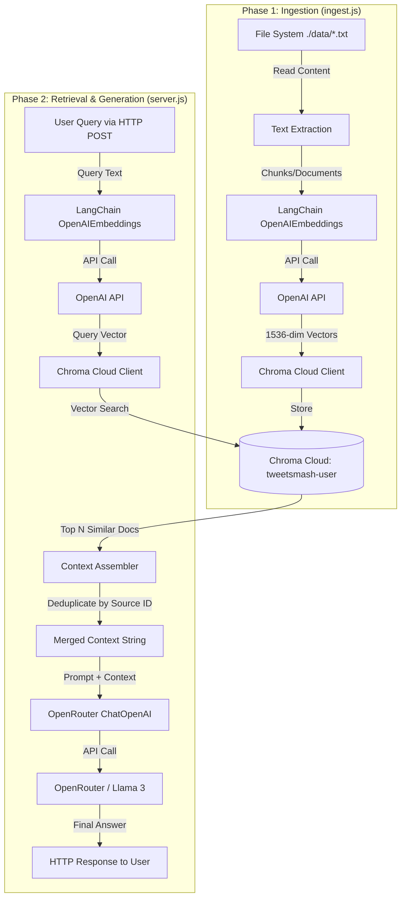

# Developer Documentation - RAG Server

This document provides a detailed overview of the RAG (Retrieval-Augmented Generation) server's architecture, data flow, and core components.

## 🏗️ System Architecture

The system is built on a modern AI stack designed for scalability and performance:

- **Backend**: Node.js with Express
- **Orchestration**: LangChain (for embeddings and LLM integration)
- **Vector Database**: Chroma Cloud (Managed Vector Store)
- **LLM Provider**: OpenRouter (access to Llama 3, OpenAI, etc.)
- **Embeddings**: OpenAI (via LangChain `OpenAIEmbeddings`)

---

## 📊 Comprehensive Data Flow

The following flowchart illustrates the entire lifecycle of data within the RAG system, from raw documents to AI-generated responses.

---

## 🔬 Detailed Step-by-Step Breakdown

### 1. The Ingestion Process (`ingest.js`)
1.  **File Discovery**: The script scans the `./data` directory for all `.txt` files using Node's `readdirSync`.
2.  **Collection Reset**: To ensure consistency (especially during development/re-indexing), it attempts to delete the existing `tweetsmash-user` collection from Chroma Cloud.
3.  **Client Initialization**: A `CloudClient` is created using the `CHROMA_TENANT`, `CHROMA_DATABASE`, and `CHROMA_API_KEY`.
4.  **Embedding Generation**:
    - Each file's content is passed to the `OpenAIEmbeddings` class.
    - An HTTP request is sent to OpenAI's embedding API (utilizing `text-embedding-3-small` by default).
    - The API returns a high-dimensional vector representation of the text.
5.  **Storage**: The documents, their unique IDs (filenames), and the corresponding vectors are sent to Chroma Cloud via the `collection.add` method.

### 2. The Retrieval & Generation Process (`server.js`)
1.  **Request Handling**: The Express server listens for POST requests at `/chat`.
2.  **Query Embedding**: Just like in ingestion, the incoming user query is converted into a vector embedding using the same `OpenAIEmbeddings` model. This ensures the query and documents are in the same vector space.
3.  **Semantic Search**:
    - The query vector is sent to Chroma Cloud.
    - Chroma performs a similarity search (likely cosine similarity) to find the top 5 most relevant documents.
4.  **Context Refinement**:
    - The retrieved documents are filtered to remove duplicates based on their metadata (specifically `source_id`).
    - The refined snippets are joined using a separator (defaulting to `\n\n---\n\n`) to create a "knowledge block".
5.  **AI Reasoning**:
    - A ChatOpenAI instance (configured for OpenRouter) is initialized.
    - A prompt is constructed: `Answer using context: [Knowledge Block] Question: [User Query]`.
    - This prompt is sent to OpenRouter, which routes it to a model like Llama 3.
6.  **Response Delivery**: The text content of the AI's response is extracted and sent back to the user as a JSON object.

---

## 🛠️ Key Components

### 1. Embedding Function
The system uses the `OpenAIEmbeddingFunction` class (defined in `server.js` and `ingest.js`) to bridge LangChain's `OpenAIEmbeddings` with ChromaDB's requirement for a `generate` method.

### 2. LLM Configuration
LLM calls are routed through OpenRouter to provide flexibility in model selection (defaulting to Llama 3 8B Instruct).

### 3. Model Context Protocol (MCP)
The `search_mcp.js` script demonstrates integration with Chroma's MCP server for specialized documentation search, allowing the system to potentially pull in external documentation.

---

## 🔒 Security & Configuration
All sensitive information is managed via environment variables:
- `OPENROUTER_API_KEY`: Authentication for LLM access.
- `CHROMA_API_KEY`: Authentication for Chroma Cloud.
- `OPENAI_API_KEY`: Used for embedding generation.

*Refer to `.env.example` for the full list of configuration options.*
